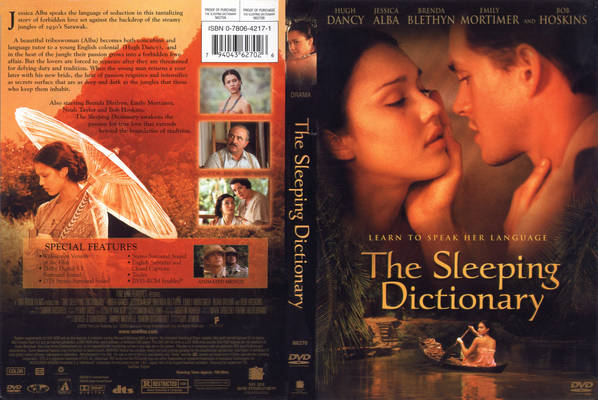

# Better English

> 최근부터는 단순히 영어를 수정한 커밋 메시지는 'better English'라고 남긴다. 뭐라 해야 할지 고민하다가 이렇게 쓰는 사람을 발견하곤 따라하고 있다.

2003년도에 [The Sleeping Dictionary][]라는 영화가 있었다. ~~흑발 글래머~~ 제시카 알바가 주연으로 나오고 '역시 언어는 연애다'라는 훈훈한 교훈을(?) 주던 영화였다. 신체 건강한 상상을 할 수도 있겠지만, 이 영화는 별로 건강하지 않다.

누군가 내가 사용하는 언어에 대해서 계속 지적질을 해주면 참 좋겠다 싶었다. 그럼 재밌게 배울 수 있을 것 같았다. ~~금발 글래머라면~~ 사람이면 더 좋겠지만, 지적질 도구라도 좋다.

나는 우리말 쓰기에 있어서 [우리말 배움터][urimal]의 도움을 많이 받았다. 이 글도 [우리말 배움터][urimal]가 없으면 오탈자가 너무 많아서 읽기 힘들었을지도 모른다.

사실 도구덕분에 글쓰기가 향상된다기 보다 그냥 꾸준히 쓰면 는다. 하지만 [우리말 배움터][urimal]가 없었다면 용기가 없어 글을 써보려고도 못했을 것 같다. 도덕적으로 완벽한 문법이 아니라는 사실이 괴롭혔을 것이다.

영어로 글을 쓸 기회를 만들기란 정말 쉽지 않은데, GitHub 덕분에 조금이나마 기회가 늘고 있다. Progit 원문에 틀린 점을 찾아서(겨우 단어 두 개 바꿨는데) [PR](https://github.com/progit/progit2/pull/232)을 보냈는데 바로 문법이 틀렸다고 다른 분이 고쳐줬었다. 이럴 때는 '우리말 배움터'가 많이 아쉽다.

도구의 한계는 분명하다. 단순한 것밖에 지적해주지 않는다. 나는 '우리말 배움터'같은 도구가 그 자체로도 유용하지만 자신감도 불어넣어 준다고 본다. 계속 노력하면 언젠가 익히는 수준을 넘어 자신만의 스타일을 가질 수 있겠지만, ~~글래머~~도구가 있으면 좀 더 쉽다. 용기도 주고 지적질도 해준다. 한계는 분명하지만 분투하는 과정에서 많은 것을 배울 수 있다.

[The Sleeping Dictionary]: http://www.imdb.com/title/tt0242888/

## 엔지니어의 글쓰기

[Software For Writers: Tools To Improve Your Writing][tools]라는 글에서 엔지니어의 글쓰기는 "Be brief, Avoid adverbs."해야 한다고 설파한다. 이 글은 영어 쓰기에서 도움 받을 수 있는 도구가 어떤 것들이 있고 어디에 쓰는지를 소개하는데 재밌다.

이 글에서 하는 조언은 아래와 같다.

### Spell Checking

철자 검사기는 최신 에디터나 브라우저에서는 대부분 지원한다. 메뉴를 찾아보면 해당 메뉴가 있을 거고 철자가 틀린 경우 빨간 줄도 그어준다.

VI나 'Emacs'같은 경우는 'aspell'이나 'hunspell'을 사용하면 된다.

### Weasel Words

> 얼버무리는 말, 모호한 말 - 다음 사전
>
> 예) many, extremely, interestingly, surprisingly

분명하게 쓰라는 거다.

- Weasel words를 쓰지 말 것.
- 수동태를 쓰지 말 것.

영어의 수동태는 괜찮다고 생각했는데 아닌 것 같다.

아래와 같은 글은:

> "The Yankees are one of the greatest baseball teams in history"

이렇게 고치는 게 좋다:

> "The New York Yankees have won 26 World Series championships—almost three times as many as any other team"

Matt Might라는 Utah대 교수는 Weasel Words와 수동태를 검사하는 [쉘 스크립트](http://matt.might.net/articles/shell-scripts-for-passive-voice-weasel-words-duplicates/)를 만들었다. [writegood-mode][]는 이 스크립트를 보고 만들어졌다.

### Clichés

> 진부한 표현, 진부한, 판에 박은 문구 - 다음 사전

이것도 쓰지 말란다. 조지 오웰의 글도 인용하고 있다.

> Never use a metaphor, simile, or other figure of speech which you are used to seeing in print. - George Orwell, "Politics and the English Language"

되도록 분명하고 직접적으로 표현하는게 좋다고 한다.

[Cliche finder](http://cliche.theinfo.org/)라는 도구로 쉽게 내 글에 얼마나 Cliche가 있는지 확인할 수 있다.

### Grammar Checking

문법 검사야말로 꼭 필요한 도구다. 나는 영어를 못하기 때문에 `We is`라든가 `a editor`라든가 하는 실수가 잦다. 문법 검사 도구는 앞으로 계속 유용하게 쓸 것 같다. 단순히 문법 검사만 하는 게 아니라 종합적으로 검사해준다:

- https://www.languagetool.org/ 은 오픈 소스 도구다. 많은 언어를 지원하지만 한국어는 없다. 웹에서 사용할 수도 있고 설치해서 사용할 수도 있다. Mac이라면 `brew install languagetool`으로 설치한다.
- http://nitpickertool.com/ 도 LanguageTool과 비슷한데 결과가 다르다. 아직 사용한지 얼마 되지 않아서 어떤 도구가 더 좋은지 모르겠다.

### Readability

[미국인의 평균 읽기 능력은 7~8학년 수준](http://en.wikipedia.org/wiki/Literacy_in_the_United_States#National_Assessment_of_Adult_Literacy_.28NAAL.29)이라서 그 수준으로 글을 써야 한다고 한다. 내 고민은 수준과 상관없이 많이 쓰는 것이라서 이 부분을 살펴보면서 긴장이 풀렸다. 쉽게도 쓸 수 없는데 뭐 이 정도 쯤이야,ㅎㅎ.

[Wikipedia의 Readability](http://en.wikipedia.org/wiki/Readability#Readability_and_newspaper_readership)에 따르면 인기 있는 TV Guide와 Readers Digest는 9학년 수준 정도로 쓰였고 "Wallaces' Farmer"라는 잡지는 1947년에 9학년 수준에서 6학년 수준으로 낮추었더니 Readability가 43%나 상승했었다고 한다.

[번역의 탄생](http://www.aladin.co.kr/shop/wproduct.aspx?ISBN=899179940X)에서 배웠던 것 중 대부분 까먹었지만, 같은 말이면 짧게 쓰라는 말은 잊지 않고 있다. 같은 뜻이면 가장 짧은 표현이 옳다고 믿는다. 영어도 그런 게 아닐까.

영어에는 신비롭게도 Readability를 검사할 수 있는 도구가 있다. 놀랍다. Readability를 검사하는 알고리즘이 있는 것도 신기하고 언젠가 한번 구경하고 싶지만, 요즘은 시간이 없어서 안될 것 같다.

나 같은 사람은 굳이 Readability 평가하지 않아도 어렵게 쓸 수 없다는 사실에 일이 준 것 같아서 잠시 좋았다(?).

Readability를 평가하는 몇 가지 지표가 있는데 [writegood-mode][]에서 내장된 두 가지 지표만 소개한다(~~살펴봤다~~). 실제로 이 두 지표가 중요 지표인 것 같다.

- [Flesch–Kincaid Grade Level](http://en.wikipedia.org/wiki/Flesch%E2%80%93Kincaid_readability_tests#Flesch.E2.80.93Kincaid_Grade_Level): 미국에서 사용하는 등급으로 10까지는 대충 그 학년까지 수학한 수준을 의미하고 10 이상은 측정하기 어렵다.

- [Flesch-Kincaid Reading Ease](http://en.wikipedia.org/wiki/Flesch%E2%80%93Kincaid_readability_tests#Flesch_Reading_Ease): 이 수치는 낮을수록 높은 수준이다:
    - `90.0–100.0`: 11살 학생 수준.
    - `60.0– 70.0`: 13 ~ 15 살 학생 수준.
    - ` 0.0– 30.0`: 대학생 수준.

https://readability-score.com/ 에서 내 글의 Readability를 검사해볼 수 있다. 내가 README에 썼던 문장을 넣으면 8~10정도 나온다. 컴퓨터 용어라서 그런가!! 이해할 수 없다.

### 체크리스트

마지막으로 체크리스트를 만들어서 지키면 도움이 된다는 건데, 이 부분을 읽으면서는 끝없이 부끄러웠다. 알고 있지만 잘 실천하지 못한다.

[Software For Writers: Tools To Improve Your Writing][tools]에서는 필자의 체크리스트를 소개하고 있다.

당장 실천할 수 있는 수단이라는 점에서 체크리스트는 가장 우수한 도구라고 생각하지만, 시간이 없어지고 바빠지면 흐지부지돼버린다.

## Javascript

이글은 [write-good][]이라는 모듈을 발견해서 쓰게 됐다. [우리말 배움터][urimal]를 상상하고 여기저기 뒤져보니까 정말 있었다.

Javascript 라이브러리들:

- [write-good][]: weasel words와 수동태 등을 검사.
- [rousseau][]: [write-good][]과 비슷.
- [node-spellchecker][]: atom의 spellchecker

찾아보면 더 많을 것 같다.

[write-good]: https://github.com/btford/write-good
[rousseau]: https://github.com/GitbookIO/rousseau
[node-spellchecker]: https://github.com/atom/node-spellchecker

## Emacs

Emacs에는 관련 도구들이 잘 통합돼 있다.

- [langtool-mode][]: "Language Tool"을 Emacs에서 사용할 수 있도록 해주는 mode
- [writegood-mode][]: Weasel words나 수동태를 쓰면 다른 색으로 표기해준다.
- [artbollocks-mode][]: [writegood-mode][]와 비슷하다는데 써보지 않았다.

[langtool-mode]: https://github.com/mhayashi1120/Emacs-langtool
[writegood-mode]: https://github.com/robertseaton/writegood-mode
[artbollocks-mode]: http://sachachua.com/blog/2011/12/emacs-artbollocks-mode-el-and-writing-more-clearly/

### Spell Checker

Emacs에서 Spell Checker는 Aspell이나 Hunspell을 연동해서 쓴다. [What is the best spell check set up in emacs][spell-check-emacs]이란 글에서 설명해주는데 설명이 기가 막히다. Aspell이 더 좋다고 설명하는데 나는 잘 모르겠다. 설명한 대로 했는데 잘 모르겠더라.

Hunspell을 사용하면 사전을 추가로 설정해야 하는데 https://github.com/titoBouzout/Dictionaries 에서 받을 수 있다. 여기서 사전을 내려받아서 `~/Library/Spelling`에 넣어 준다. `en_US.aff`, `en_US.dic`처럼 적당한 이름으로 바꿔서 넣는다.

Homebrew로 설치한 Aspell은 왠지 사전을 요구하지 않아서 찾아보지 않았다.

## 유료

사서 쓰면 편하겠지. ~~금발 글래머가~~제시카 알바가 그래머(Grammar)를 지적해줄지도 몰라.

- http://www.hemingwayapp.com/

## 참고

이 글은 아래 세 글을 정리한 것이다.

- [Software For Writers: Tools To Improve Your Writing][tools]
- [write-good][]
- [What is the best spell check set up in emacs][spell-check-emacs]

[tools]: http://rs.io/software-writers-tools-improve-writing/
[spell-check-emacs]: http://blog.binchen.org/posts/what-s-the-best-spell-check-set-up-in-emacs.html
[urimal]: http://urimal.cs.pusan.ac.kr/urimal_new/
