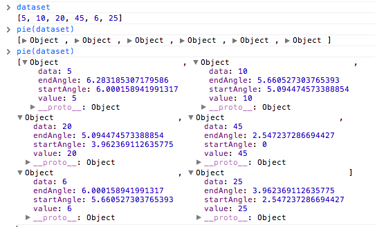

# d3js: chapter 12. geomapping

> 이 글은 http://infovis.kr 스터디 하면서 작성했고 [d3.js](http://www.aladin.co.kr/shop/wproduct.aspx?ISBN=896626106X) 12장의 내용이다.

## GeoJSON

```json
{
    "type":"FeatureCollection",
    "features":[{
        "type":"Feature", // 주 단위 데이터 타입
        "id":"01",
        "properties":{"name":"Alabama"},
        "geometry":{
            "type":"Polygon",
            "coordinates":[[[-87.359296,35.00118],
                [-85.606675,34.984749], [-85.431413,34.124869],
                [-85.184951,32.859696], [-85.069935,32.580372],
                [-84.960397,32.421541], [-85.004212,32.322956],
                [-84.889196,32.262709], [-85.058981,32.13674],
                ...
            ]]
        }
    }, {
        "type":"Feature",
        "id":"02",
        "properties":{"name":"Alaska"},
        "geometry":{
            "type":"MultiPolygon",
            "coordinates":[
                [[[-131.602021,55.117982], [-131.569159,55.28229],
                [-131.355558,55.183705], [-131.38842,55.01392],
                [-131.645836,55.035827], [-131.602021,55.117982]]],
                [[[-131.832052,55.42469],[-131.645836,55.304197],
                [-131.749898,55.128935],[-131.832052,55.189182],
                [-131.832052,55.42469]]]
                ...
            ]
        }
    },
    ...
}
```

- Feature가 주 단위 데이터.
- 좌표는 ~~위도, 경도가 익숙하지만~~ "[경도(latitude), 위도(longitude)]"로 표현: `[-131.832052,55.189182]`
  - 경도: 세로, 131.832052
  - 위도: 가로, 55.189182
- 좌표 찾기 from Michal Migurski: http://teczno.com/squares

이 데이터를 d3로 그려보자:

<p id="phr-path"></p>

```js
//Width and height
const w = 500;
const h = 300;

//Define default path generator
var path = d3.geo.path();

//Create SVG element
var svg = d3.select('#phr-path')
            .append('svg')
            .attr('width', w)
            .attr('height', h);

//Load in GeoJSON data
d3.json('us-states.json', (json)=> {

    //Bind data and create one path per GeoJSON feature
    svg.selectAll('path')
       .data(json.features)
       .enter()
       .append('path')
       .attr('d', path);
});
```

### Path

잠깐 svg path와 d3에서 path 사용하는 방법을 익혀보자. 이 내용은 11장의 pie layout을 설명하는 내용이다.

path는 아래처럼 생김:

```html
<path fill="#d62728" d="M9,184850993605149e-15,-150A150,150 0 0,
    18399621792063931,124.27644738657631L0,0Z"></path>
```

pie layout:

```
var dataset = [5, 10, 20, 45, 5, 25];

// pie layout
var pie = d3.layout.pie();
```



pie chart 그리기:

<div id="phr-pie-chart"></div>

```js
//Width and height
const w = 300;
const h = 300;

const dataset = [ 5, 10, 20, 45, 6, 25 ];

var outerRadius = w / 2;
var innerRadius = 0;
var arc = d3.svg.arc()
    .innerRadius(innerRadius)
    .outerRadius(outerRadius);

var pie = d3.layout.pie();

//Easy colors accessible via a 10-step ordinal scale
//Synthia Brewer
var color = d3.scale.category10();

//Create SVG element
var svg = d3.select("#phr-pie-chart")
    .append("svg")
    .attr("width", w)
    .attr("height", h);

//Set up groups
var arcs = svg.selectAll("g.arc")
    .data(pie(dataset))
    .enter()
        .append("g")
        .attr("class", "arc")
        .attr("transform", `translate(${outerRadius},${outerRadius})`);

//Draw arc paths
arcs.append("path")
    .attr("fill", (d, i)=> color(i))
    .attr("d", arc);

//Labels
arcs.append("text")
    .attr("transform", (d)=> `translate(${arc.centroid(d)})`) //도형의 중심점에 위치시킨다
    .attr("text-anchor", "middle")
    .text((d)=> d.value);
```

- "Synthia Brewer": 어떤 색 패턴이 사람에게 잘 인식되는지 실험을 통해 찾은 패턴

## 12.3 투영법

> 3차원 데이터를 2차원에 투영하는 방법 - p268

- Jason Davies: http://www.jasondavies.com/
- D3가 제공하는 Projections: https://github.com/mbostock/d3/wiki/Geo-Projections
- D3 Projection 비교 해보기: http://bl.ocks.org/mbostock/3711652
- D3로 그린 한국 지도: http://codefactory.kr/2013/05/17/korea-map/

<p id="phr-projection"></p>

```js
//Width and height
const w = 500;
const h = 300;

//Define map projection
var projection = d3.geo.albersUsa()
    //.translate([w/3, h/2]); // 위치
    .translate([w/2, h/2])
    .scale([500]); //default 1000

//Define path generator
var path = d3.geo.path()
                 .projection(projection);

//Create SVG element
var svg = d3.select("#phr-projection")
            .append("svg")
            .attr("width", w)
            .attr("height", h);

//Load in GeoJSON data
d3.json("us-states.json", (json)=> {

    //Bind data and create one path per GeoJSON feature
    svg.selectAll("path")
        .data(json.features)
        .enter()
        .append("path")
        //.attr("d", path);
        .attr("d", path)
        .style("fill", "steelblue");

});
```

## 12.4 단계 구분도(Choropleth)

- 적색주와 청색주: http://ko.wikipedia.org/wiki/%EC%A0%81%EC%83%89%EC%A3%BC%EC%99%80_%EC%B2%AD%EC%83%89%EC%A3%BC
    - 영어: http://en.wikipedia.org/wiki/Red_states_and_blue_states
    - 단점: 인구 밀도는 낮고 큰 지역 처럼 여러 정보는 표현하기 어렵다.

<p id="phr-choropleth"></p>

데이터 `us-ag-productivity-2004.cvs`:

```
state,value
Alabama,1.1791
Arkansas,1.3705
Arizona,1.3847
California,1.7979
Colorado,1.0325
```

`state,value`는 프로퍼티 이름이 된다:

> 이 데이터는 미국 농무부(USDA)가 제고앟는 데이터로, 2004년 한 해 동안 믹국 각 주별 농작물 생산 능력을 1996년 앨라바바(Alabama) 주 생산량을 1.0으로 삼아 서 표현한 데이터다. 그러므로 클수록 생산성이 좋은 주가 된다.(미 정부 공개 데이터는 http://data.gov를 통해 제공된다. - p271

```
[
    {
        state: "Alabama",
        value: "1.1791"
    },
    ...
]
```

Choropleth 그리기:

```js
//Width and height
const w = 500;
const h = 300;

//Define map projection
var projection = d3.geo.albersUsa()
                       .translate([w/2, h/2])
                       .scale([500]);

//Define path generator
var path = d3.geo.path()
                 .projection(projection);

//Define quantize scale to sort data values into buckets of color
var color = d3.scale.quantize()
    .range(["rgb(237,248,233)",
        "rgb(186,228,179)",
        "rgb(116,196,118)",
        "rgb(49,163,84)",
        "rgb(0,109,44)"]);
        //Colors taken from colorbrewer.js, included in the D3 download
        //domain은 선형이지만 치역이 5개로 매핑됨.
        //domain은 데이터에서 min, max로 추출한다.

//Create SVG element
var svg = d3.select("#phr-choropleth")
            .append("svg")
            .attr("width", w)
            .attr("height", h);

//Load in agriculture data
d3.csv("us-ag-productivity-2004.csv", (data)=> {

    //Set input domain for color scale
    color.domain([
        d3.min(data, (d)=> d.value),
        d3.max(data, (d)=> d.value)
    ]);

    //Load in GeoJSON data
    d3.json("us-states.json", (json)=> {

        //Merge the ag. data and GeoJSON
        //Loop through once for each ag. data value
        for(var x of data) {
            //Find the corresponding state inside the GeoJSON
            var f = json.features.find((f)=> x.state == f.properties.name)

            if(f){
                f.properties.value = parseFloat(x.value);
            }
        }

        //Bind data and create one path per GeoJSON feature
        svg.selectAll("path")
            .data(json.features)
            .enter()
            .append("path")
            .attr("d", path)
            .style("fill", (d)=> {
                 //Get data value
                 var value = d.properties.value;

                 return value? color(value): "#ccc";
            });
    });

});
```

## 12.5 포인트 지점 추가하기.

<p id="phr-point"></p>

`us-cities.csv`:

```
rank,place,population,lat,lon
1,New York city,8175133,40.71455,-74.007124
2,Los Angeles city,3792621,34.05349,-118.245323
3,Chicago city,2695598,45.37399,-92.888759
4,Houston city,2099451,41.337462,-75.733627
```

- 데이터 만들기(저자의 Favorite): http://www.gpsvisualizer.com/geocoder/
- 데이터 수동 확인: http://teczno.com/squares

```js
//Width and height
var w = 500;
var h = 300;

//Define map projection
var projection = d3.geo.albersUsa()
                   .translate([w/2, h/2])
                   .scale([500]);

//Define path generator
var path = d3.geo.path()
             .projection(projection);

//Define quantize scale to sort data values into buckets of color
var color = d3.scale.quantize()
    .range(["rgb(237,248,233)",
        "rgb(186,228,179)",
        "rgb(116,196,118)",
        "rgb(49,163,84)",
        "rgb(0,109,44)"]);
    //Colors taken from colorbrewer.js, included in the D3 download

//Create SVG element
var svg = d3.select("#phr-point")
    .append("svg")
    .attr("width", w)
    .attr("height", h);

//Load in agriculture data
d3.csv("us-ag-productivity-2004.csv", function(data) {

    //Set input domain for color scale
    color.domain([
        d3.min(data, (d)=> d.value),
        d3.max(data, (d)=> d.value)
    ]);

    //Load in GeoJSON data
    d3.json("us-states.json", (json)=> {

        //Merge the ag. data and GeoJSON
        //Loop through once for each ag. data value
        for(var x of data) {
            //Find the corresponding state inside the GeoJSON
            var f = json.features.find((f)=> x.state == f.properties.name)

            if(f){
                f.properties.value = parseFloat(x.value);
            }
        }

        //Bind data and create one path per GeoJSON feature
        svg.selectAll("path")
            .data(json.features)
            .enter()
            .append("path")
            .attr("d", path)
            .style("fill", (d)=> {
                 //Get data value
                 var value = d.properties.value;

                 return value? color(value): "#ccc";
            });
    });

    //Load in cities data
    d3.csv("us-cities.csv", function(data) {

        svg.selectAll("circle")
            .data(data)
            .enter()
            .append("circle")
            // scale은 파라미터가 하나고 리턴값이 하나인 함수지만
            // projection은 파라미터가 두 개고 리턴값이 두 개인 함수.
            .attr("cx", (d)=> projection([d.lon, d.lat])[0])
            .attr("cy", (d)=> projection([d.lon, d.lat])[1])
            // Scale을 적용해봄직하다.
            .attr("r", (d)=> Math.sqrt(parseInt(d.population) * 0.00004))
            //.attr("r", 5)
            .style("fill", "yellow")
            .style("opacity", 0.75);
    });
});
```

## 12.6 지오데이터 취득과 분석.

### 1. shape 파일 찾기

- 포멧은 지리 정보 시스템(GIS) 소프트웨어를 사용되는 포멧 - p279
- 적당한 GeoJSON 데이터를 찾을 수 없으면 Shape 파일 찾자.
    - Natural Earth(http://www.naturalearthdata.com): 방대한 지리정보의 보고, 오픈
    - The United States Census: http://www.census.gov/geo/www/cob/cbf_state.html

### 2. 축척을 선택

자료마다 축척이 다를 수도 있지만, 미국 인구조사 세이프 파은 대부분 다음 세가지 중 하나:

- 1:500,000(1:500k)
- 1:5,000,000(1:5m)
- 1:20,000,000(1:20m)

소축척, 대축척, 고추척:

- 소축척: 1:500k -> 1: 5m -> 1: 20m
- 대축척, 고추척: 1:500k <- 1: 5m <- 1:20m

Natural Earth에서 가장 축척이 작은 오대양 지도(1:110m):

http://www.naturalearthdata.com/downloads/110m-physical-vectors/110m-ocean/

### 3. 세이프를 단순화

- 마이크 보스탁의 라인을 단순화하는 데모: http://bost.ocks.org/mike/simplify/
    - D3.simplify 플러그인 사용
- Matt Bloch의 MapShaper: http://mapshaper.org
    - 지도를 단순화 해서 Shapefile, GeoJSON, TopoJSON로 변환할 수 있다.
    - 사용번 p282에 설명함
- JavaScript 라이브러리
    - Mike Migurski의 Bloch: https://github.com/migurski/Bloch
    - D3.simplify 플러그인: TopoJSON으로 대체됨.
- 기하학적 단순화 프로젝트 TopoJSON(https://github.com/mbostock/topojson)
    - GeoJSON 보다 신상이며 효율적
    - http://bl.ocks.org/4090870

### 4. GeoJSON으로 변환

Shapefile을 GeoJSON으로 변환하는 **ogr2ogr** 명령어 사용법이 책에 잘 설명돼 있음.

마지막으로 투영법(Projection)을 변경해보는 예제:

<p id="phr-mercator"></p>

```js
//Width and height
const w = 700;
const h = 500;

//Define map projection
//var projection = d3.geo.albersUsa()
var projection = d3.geo.mercator()
                       .translate([w/2, h/2])
                       .scale([100]);

//Define path generator
var path = d3.geo.path()
                 .projection(projection);

//Create SVG element
var svg = d3.select("#phr-mercator")
            .append("svg")
            .attr("width", w)
            .attr("height", h);

//Load in GeoJSON data
d3.json("oceans.json", function(json) {

    //Bind data and create one path per GeoJSON feature
    svg.selectAll("path")
       .data(json.features)
       .enter()
       .append("path")
       .attr("d", path)
       .style("fill", "steelblue");

});
```
